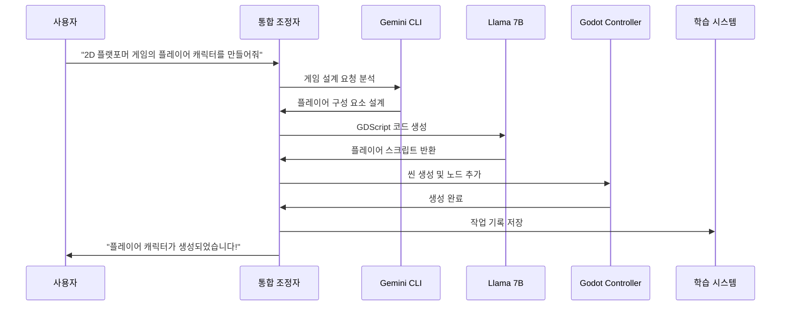

# AutoCI 24시간 게임 제작 AI Agent 시스템 아키텍처

## 개요
AutoCI는 Llama 7B, Gemini CLI, Godot Engine을 통합하여 24시간 자동으로 작동하는 게임 제작 AI Agent입니다. 
사용자와의 자연어 대화를 통해 Godot 게임 엔진을 완전히 제어하고 게임을 자동으로 제작할 수 있습니다.

## 시스템 구성도

```
┌─────────────────────────────────────────────────────────────────────────────┐
│                           AutoCI 24시간 AI Agent                             │
├─────────────────────────────────────────────────────────────────────────────┤
│                                                                             │
│  ┌───────────────────┐  ┌──────────────────┐  ┌─────────────────────┐     │
│  │   대화 인터페이스   │  │   지능형 의사결정  │  │    학습 시스템      │     │
│  │                   │  │                   │  │                     │     │
│  │ • 한국어/영어 처리 │  │ • 작업 계획 수립   │  │ • 24시간 지속 학습  │     │
│  │ • 의도 파악       │  │ • 우선순위 결정    │  │ • 경험 데이터베이스  │     │
│  │ • 컨텍스트 관리   │  │ • 실행 전략 수립   │  │ • 패턴 인식/최적화  │     │
│  └───────────────────┘  └──────────────────┘  └─────────────────────┘     │
│             │                     │                        │                │
│  ┌──────────┴─────────────────────┴────────────────────────┴──────────┐     │
│  │                       통합 조정자 (Orchestrator)                    │     │
│  │  • 모델 간 작업 분배  • 응답 통합  • 상태 관리  • 오류 처리        │     │
│  └────────────────────────────────────────────────────────────────────┘     │
│             │                     │                        │                │
│  ┌──────────┴──────────┐ ┌───────┴────────┐  ┌──────────┴──────────┐     │
│  │    Llama 7B 모듈    │ │  Gemini CLI    │  │   Godot Controller  │     │
│  │                     │ │                │  │                     │     │
│  │ • 코드 생성/이해    │ │ • 고급 추론     │  │ • 엔진 제어 API    │     │
│  │ • GDScript 작성    │ │ • 문제 해결     │  │ • 씬 관리          │     │
│  │ • 로컬 처리        │ │ • 창의적 설계   │  │ • 노드 조작        │     │
│  │ • 빠른 응답        │ │ • 복잡한 대화   │  │ • 리소스 관리      │     │
│  └──────────┬──────────┘ └───────┬────────┘  └──────────┬──────────┘     │
│             │                     │                        │                │
└─────────────┼─────────────────────┼────────────────────────┼────────────────┘
              │                     │                        │
              ▼                     ▼                        ▼
       ┌─────────────┐      ┌──────────────┐         ┌──────────────┐
       │ Local Model │      │ Gemini API  │         │ Godot Engine │
       │  (Llama 7B) │      │   Service    │         │   + Plugin   │
       └─────────────┘      └──────────────┘         └──────────────┘
```

## 핵심 구성 요소

### 1. 통합 조정자 (Orchestrator)
- **역할**: 모든 구성 요소 간의 통신과 작업 흐름을 관리
- **기능**:
  - 사용자 입력 분석 및 적절한 모듈로 라우팅
  - 여러 모듈의 응답 통합
  - 작업 상태 추적 및 오류 복구
  - 24시간 운영을 위한 안정성 보장

### 2. Llama 7B 통합 모듈
- **역할**: 빠른 코드 생성 및 로컬 처리
- **장점**:
  - 오프라인 작동 가능
  - 빠른 응답 시간
  - GDScript 코드 생성 특화
  - 개인정보 보호

### 3. Gemini CLI 통합 모듈
- **역할**: 고급 추론 및 복잡한 문제 해결
- **장점**:
  - 최신 AI 기능 활용
  - 복잡한 게임 로직 설계
  - 창의적인 아이디어 생성
  - 대규모 컨텍스트 처리

### 4. Godot 제어 시스템
- **역할**: Godot 엔진의 완전한 제어
- **기능**:
  - HTTP/WebSocket API를 통한 엔진 제어
  - 실시간 씬 조작
  - 자동 빌드 및 테스트
  - 리소스 관리

### 5. 24시간 학습 시스템
- **역할**: 지속적인 성능 향상
- **기능**:
  - 사용자 상호작용 학습
  - 성공/실패 패턴 분석
  - 최적화된 작업 흐름 개발
  - 지식 베이스 확장

## 작업 흐름 예시

### 사용자 요청: "2D 플랫포머 게임의 플레이어 캐릭터를 만들어줘"



## 주요 기능

### 1. 자연어 게임 제작
```python
# 사용 예시
"간단한 점프 게임을 만들어줘"
→ AutoCI가 자동으로:
  - 게임 구조 설계
  - 필요한 씬과 노드 생성
  - 게임 로직 구현
  - 테스트 및 실행
```

### 2. 실시간 수정
```python
"플레이어의 점프 높이를 2배로 늘려줘"
→ 즉시 코드 수정 및 적용
```

### 3. 지능적 문제 해결
```python
"게임이 너무 어려운 것 같아"
→ 난이도 분석 및 자동 조정
```

### 4. 24시간 자율 작업
```python
"이 게임에 10개의 레벨을 추가로 만들어줘"
→ 백그라운드에서 자동으로 레벨 생성
```

## 기술 스택

### 언어 및 프레임워크
- Python 3.10+ (메인 시스템)
- GDScript (Godot 스크립팅)
- JavaScript/TypeScript (Gemini CLI)

### AI 모델
- Llama 7B (로컬 추론)
- Gemini Pro (클라우드 추론)

### 통신 프로토콜
- HTTP REST API
- WebSocket (실시간 통신)
- JSON-RPC

### 데이터베이스
- SQLite (학습 데이터)
- Redis (캐싱, 옵션)

### 모니터링
- 실시간 대시보드
- 로그 수집 및 분석
- 성능 메트릭

## 보안 고려사항

1. **API 인증**: 토큰 기반 인증
2. **샌드박스 실행**: 안전한 코드 실행 환경
3. **입력 검증**: 모든 사용자 입력 검증
4. **감사 로그**: 모든 작업 기록

## 확장성

### 수평적 확장
- 여러 Godot 인스턴스 동시 제어
- 작업 큐를 통한 부하 분산

### 모듈식 설계
- 새로운 AI 모델 쉽게 추가
- 다른 게임 엔진 지원 가능
- 플러그인 시스템

## 성능 목표

- **응답 시간**: < 2초 (간단한 작업)
- **동시 작업**: 10+ 작업 동시 처리
- **가동 시간**: 99.9% (24시간 운영)
- **학습 효율**: 일일 10% 성능 향상

## 구현 로드맵

### Phase 1: 기본 통합 (1-2주)
- [ ] Llama 7B 로컬 설정
- [ ] Gemini CLI 연동
- [ ] Godot API 플러그인 개발
- [ ] 기본 통합 조정자

### Phase 2: 지능형 기능 (2-3주)
- [ ] 자연어 처리 파이프라인
- [ ] 작업 계획 시스템
- [ ] 오류 복구 메커니즘

### Phase 3: 24시간 학습 (3-4주)
- [ ] 학습 데이터베이스 구축
- [ ] 패턴 인식 시스템
- [ ] 자동 최적화

### Phase 4: 고급 기능 (4-5주)
- [ ] 복잡한 게임 로직 생성
- [ ] 다중 프로젝트 관리
- [ ] 협업 기능

## 결론

AutoCI는 게임 개발의 패러다임을 바꾸는 혁신적인 AI Agent 시스템입니다. 
24시간 자동으로 작동하며, 사용자의 자연어 명령만으로 완전한 게임을 제작할 수 있습니다.
지속적인 학습을 통해 점점 더 똑똑해지며, 게임 개발의 생산성을 극대화합니다.