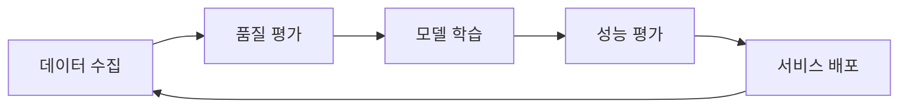

# 🤖 AutoCI - 24시간 AI 코딩 공장

<div align="center">
  
  
  
</div>

## 📋 프로젝트 개요

AutoCI는 Code Llama 7B-Instruct 모델을 기반으로 C# 전문가 수준의 AI 코딩 어시스턴트를 구축하는 프로젝트입니다. 24시간 자동 학습을 통해 지속적으로 발전하며, 실시간으로 코드를 개선할 수 있는 개인 코딩 공장입니다.
WSL 환경의 터미널에서도 작동.

### 🎯 핵심 목표
- **C# 박사/전문가 수준의 AI 모델 구축**
- **24시간 자동 학습 및 개선 시스템**
- **실시간 코드 생성, 검색, 개선 서비스**

### 🚀 3대 핵심 기능

1. **🧠 AI 코드 생성** (Code Llama 7B-Instruct)
   - C# 전문 코드 생성
   - 디자인 패턴 적용
   - 베스트 프랙티스 준수

2. **🔍 지능형 코드 검색** (ML.NET)
   - 의미 기반 검색
   - 코드 유사도 분석
   - 실시간 인덱싱

3. **💬 프로젝트 Q&A** (RAG 시스템)
   - README 기반 질의응답
   - 프로젝트 문서 이해
   - 컨텍스트 기반 답변

## 🛠️ 시스템 요구사항

### 최소 사양
- **RAM**: 16GB (모델 실행)
- **Storage**: 50GB (모델 + 학습 데이터)
- **Python**: 3.8 이상
- **OS**: Windows 10/11, Linux, macOS

### 권장 사양
- **RAM**: 32GB 이상
- **GPU**: NVIDIA GPU with 8GB+ VRAM
- **Storage**: 100GB+ SSD
- **Internet**: 안정적인 연결 (데이터 수집)

## ⚡ 빠른 시작 (5분 안에 시작하기)

### 1단계: 전체 시스템 자동 설치 및 실행
```bash
# 1. 프로젝트 클론
git clone https://github.com/yourusername/AutoCI.git
cd AutoCI

# 2. 전문가 학습 시스템 설치 및 시작
python start_expert_learning.py

# 3. 한 번에 모든 서비스 시작
python start_all.py
```

### 2단계: 웹 인터페이스 접속
- **AI 코드 생성**: http://localhost:7100/codegen
- **스마트 검색**: http://localhost:7100/codesearch
- **프로젝트 Q&A**: http://localhost:7100/rag
- **학습 대시보드**: http://localhost:8080/dashboard

## 📚 상세 구축 가이드

### 1. Code Llama 7B-Instruct 설정

#### 1.1 환경 준비
```bash
# Python 가상환경 생성
python -m venv llm_venv
source llm_venv/bin/activate  # Linux/Mac
llm_venv\Scripts\activate     # Windows

# 필요 패키지 설치 (자동으로 설치됨)
pip install -r requirements_expert.txt
```

#### 1.2 모델 자동 다운로드
```bash
# start_expert_learning.py가 자동으로 처리
# 수동 다운로드가 필요한 경우:
python download_model.py
```

#### 1.3 AI 서버 실행
```bash
# 자동 실행 (start_all.py 사용 시)
# 수동 실행:
cd MyAIWebApp/Models
uvicorn enhanced_server:app --host 0.0.0.0 --port 8000
```

### 2. 24시간 C# 전문가 학습 시스템

#### 2.1 자동 학습 아키텍처
```
┌─────────────────────────────────────────────────┐
│           24시간 학습 사이클                      │
├─────────────────────────────────────────────────┤
│  4시간: GitHub/StackOverflow 데이터 수집         │
│  1시간: 데이터 전처리 및 품질 검증               │
│  6시간: Code Llama 모델 파인튜닝                │
│  1시간: 모델 평가 및 배포                       │
│ 12시간: 실시간 코드 개선 서비스                 │
└─────────────────────────────────────────────────┘
```

#### 2.2 학습 데이터 소스
- **GitHub**: Stars 10,000+ C# 프로젝트
- **Stack Overflow**: Score 50+ C# Q&A
- **Microsoft Docs**: 공식 C# 문서
- **사용자 프로젝트**: 로컬 C# 코드

#### 2.3 코드 품질 평가 기준
| 평가 항목 | 가중치 | 설명 |
|-----------|--------|------|
| XML 문서 주석 | 20% | /// 주석 포함 여부 |
| 디자인 패턴 | 15% | SOLID, GoF 패턴 사용 |
| 현대적 C# 기능 | 15% | async/await, LINQ, 패턴 매칭 |
| 에러 처리 | 10% | try-catch, 예외 처리 |
| 코드 구조 | 10% | 적절한 길이, 모듈화 |
| 테스트 코드 | 5% | 단위 테스트 포함 |

### 3. ML.NET 기반 지능형 코드 검색

C# Backend의 `SearchService.cs`에서 ML.NET을 사용한 지능형 코드 검색 구현:
- TF-IDF 기반 텍스트 임베딩
- 코사인 유사도를 이용한 검색
- 실시간 코드 인덱싱

### 4. RAG 기반 프로젝트 Q&A

C# Backend의 `RAGService.cs`에서 README 기반 질의응답 시스템 구현:
- README.md 파일 자동 파싱
- ML.NET을 이용한 문서 검색
- 컨텍스트 기반 답변 생성

### 5. 🚀 통합 실행

#### 5.1 한 번에 모든 서비스 시작
```bash
# 모든 서비스 자동 시작
python start_all.py
```

#### 5.2 개별 서비스 실행
```bash
# 24시간 전문가 학습 시스템
python csharp_expert_crawler.py

# AI 모델 서버
cd MyAIWebApp/Models
uvicorn enhanced_server:app --host 0.0.0.0 --port 8000

# C# Backend
cd MyAIWebApp/Backend
dotnet run

# Blazor Frontend
cd MyAIWebApp/Frontend
dotnet run

# 모니터링 API
python expert_learning_api.py
```

## 💡 주요 사용 시나리오

### 1. AI 코드 생성
```csharp
// 입력: "Repository 패턴을 사용한 사용자 관리 서비스 생성"
// 출력: 완전한 C# 코드 with 베스트 프랙티스
public interface IUserRepository { ... }
public class UserRepository : IUserRepository { ... }
public class UserService { ... }
```

### 2. 스마트 코드 검색
- "비동기 파일 업로드 구현" → 관련 코드 즉시 검색
- "Entity Framework 성능 최적화" → 최적화 패턴 제시

### 3. 프로젝트 Q&A
- "이 프로젝트의 인증 방식은?" → README 기반 정확한 답변
- "API 엔드포인트 목록?" → 프로젝트 구조 분석 후 답변

### 4. 24시간 코드 개선
- 자동으로 코드 품질 분석
- 개선 제안 파일 생성 (*_improvements.md)
- 실시간 리팩토링 추천

## ⚠️ 주의사항 및 최적화 팁

### 필수 확인사항
- ✅ RAM 16GB 이상 (32GB 권장)
- ✅ Python 3.8 이상
- ✅ 안정적인 인터넷 연결
- ✅ 50GB 이상 여유 공간

### 성능 최적화
1. **GPU 사용** (10배 빠른 학습)
   ```bash
   # CUDA 설치 확인
   nvidia-smi
   ```

2. **API 키 설정** (더 많은 데이터 수집)
   ```bash
   # .env 파일 편집
   GITHUB_TOKEN=your_github_token
   STACKOVERFLOW_KEY=your_stack_key
   ```

3. **메모리 최적화**
   - 8-bit 양자화 사용 (메모리 50% 절약)
   - Gradient checkpointing 활성화

## 📊 모니터링 및 관리

### 웹 대시보드
```bash
# 브라우저에서 열기
http://localhost:8080/dashboard/expert_learning_dashboard.html
```

### 실시간 모니터링
- 📈 학습 진행률
- 📊 수집된 데이터 통계
- 🎯 모델 성능 지표
- 🔧 코드 개선 횟수

### API 엔드포인트
| 엔드포인트 | 메서드 | 설명 |
|-----------|--------|------|
| `/api/status` | GET | 현재 시스템 상태 |
| `/api/start` | POST | 학습 시작 |
| `/api/stop` | POST | 학습 중지 |
| `/api/stats` | GET | 통계 조회 |
| `/api/improve` | POST | 코드 개선 요청 |
| `/api/logs` | GET | 로그 조회 |

## 🔧 문제 해결

#### 모델 다운로드 문제
```bash
# 수동으로 모델 다운로드
python download_model.py

# 모델 존재 확인
python download_model.py --check-only
```

#### Python 패키지 설치
```bash
cd MyAIWebApp/Models
pip install -r requirements.txt
```

#### 포트 충돌 시
- Python AI Server: 8000 → 다른 포트로 변경
- Backend: 5049 → launchSettings.json에서 변경
- Frontend: 7100 → launchSettings.json에서 변경

## 🧠 고급 기능: 24시간 전문가 학습 시스템

### 자동 진화하는 AI
Code Llama가 24시간 동안 지속적으로 학습하여 C# 전문가로 성장:



### 학습 데이터 품질 기준
```python
# 최소 품질 점수: 0.8/1.0
quality_criteria = {
    "has_xml_docs": 0.20,      # XML 문서화
    "uses_patterns": 0.15,     # 디자인 패턴
    "modern_csharp": 0.15,     # 최신 C# 기능
    "follows_solid": 0.15,     # SOLID 원칙
    "error_handling": 0.10,    # 예외 처리
    "appropriate_length": 0.10  # 적절한 크기
}
```

### 수집되는 전문 지식
1. **GitHub 프로젝트** (Stars 10,000+)
   - dotnet/roslyn
   - dotnet/aspnetcore
   - Unity-Technologies/UnityCsReference
   - JamesNK/Newtonsoft.Json

2. **Stack Overflow** (Score 50+)
   - 베스트 프랙티스 Q&A
   - 성능 최적화 팁
   - 디버깅 솔루션

3. **Microsoft 공식 문서**
   - C# 언어 레퍼런스
   - .NET API 문서
   - 디자인 가이드라인

### 실시간 코드 개선 예시
```csharp
// 😰 개선 전 (품질 점수: 0.4)
public class UserManager {
    public List<User> users = new List<User>();
    public void AddUser(string name) {
        users.Add(new User { Name = name });
    }
}

// 😊 AI 개선 후 (품질 점수: 0.9)
/// <summary>
/// 사용자 관리를 위한 서비스
/// </summary>
public interface IUserManager {
    Task<User> AddUserAsync(string name, CancellationToken cancellationToken = default);
}

public class UserManager : IUserManager {
    private readonly IUserRepository _repository;
    private readonly ILogger<UserManager> _logger;
    
    public UserManager(IUserRepository repository, ILogger<UserManager> logger) {
        _repository = repository ?? throw new ArgumentNullException(nameof(repository));
        _logger = logger ?? throw new ArgumentNullException(nameof(logger));
    }
    
    public async Task<User> AddUserAsync(string name, CancellationToken cancellationToken = default) {
        if (string.IsNullOrWhiteSpace(name)) {
            throw new ArgumentException("사용자 이름은 필수입니다.", nameof(name));
        }
        
        try {
            var user = new User { Name = name, CreatedAt = DateTime.UtcNow };
            await _repository.AddAsync(user, cancellationToken);
            _logger.LogInformation("새 사용자 추가: {UserName}", name);
            return user;
        }
        catch (Exception ex) {
            _logger.LogError(ex, "사용자 추가 실패: {UserName}", name);
            throw;
        }
    }
}
```

## 🎯 프로젝트 구조

```
AutoCI/
├── 📁 MyAIWebApp/
│   ├── 📁 Backend/         # ASP.NET Core API
│   │   ├── Services/       # AI, 검색, RAG 서비스
│   │   └── Controllers/    # API 컨트롤러
│   ├── 📁 Frontend/        # Blazor WebAssembly
│   │   ├── Pages/          # UI 페이지
│   │   └── wwwroot/        # 정적 파일
│   └── 📁 Models/          # Python AI 모델
│       ├── enhanced_server.py
│       └── fine_tune.py
├── 📁 expert_training_data/  # 학습 데이터
├── 📄 csharp_expert_crawler.py  # 24시간 학습 엔진
├── 📄 start_expert_learning.py  # 설치 스크립트
├── 📄 expert_learning_api.py    # 모니터링 API
└── 📄 start_all.py              # 통합 실행
```

## 🤝 기여하기

1. Fork the Project
2. Create your Feature Branch (`git checkout -b feature/AmazingFeature`)
3. Commit your Changes (`git commit -m 'Add some AmazingFeature'`)
4. Push to the Branch (`git push origin feature/AmazingFeature`)
5. Open a Pull Request

## 📝 라이선스

MIT License - 자유롭게 사용하세요!

## 🙏 감사의 말

- Meta AI의 Code Llama 팀
- Microsoft의 ML.NET 팀
- 오픈소스 커뮤니티

---

<div align="center">
  <h3>🚀 24시간 동안 진화하는 당신만의 AI 코딩 공장을 만들어보세요!</h3>
  <p>문의사항이나 버그 리포트는 Issues에 남겨주세요.</p>
</div>